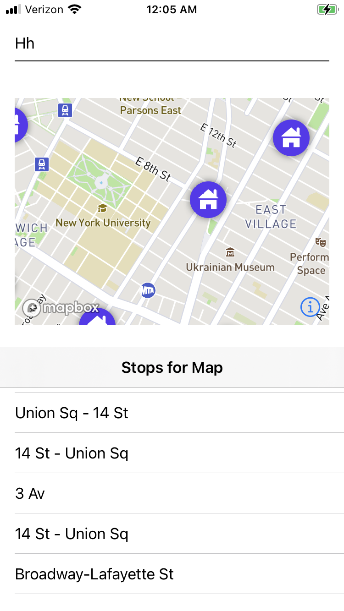

# GTFS service

## Look routes by agency - or provider of a single GTFS zip 
http://localhost:3000/routes?agency=NYCSubway

## Look up stops by the agency and route and direction
http://localhost:3000/stopsbyroute?agency=NYCSubway&routeid=Q&direction=1

# Look up the stop within a center point and a radius in miles
http://localhost:3000/stopsbycircle?latitude=40.756122&longitude=-73.985580&radius=5

# Look up stop times (schedules)
http://localhost:3000/stoptimes?agency=NYCSubway&stopid=Q05S

# Mapbox Sample screen shot built with SwiftUI (Swift5 on iOS 14)
Sample MapBox SwiftUI app Using the Stop look up :

 
